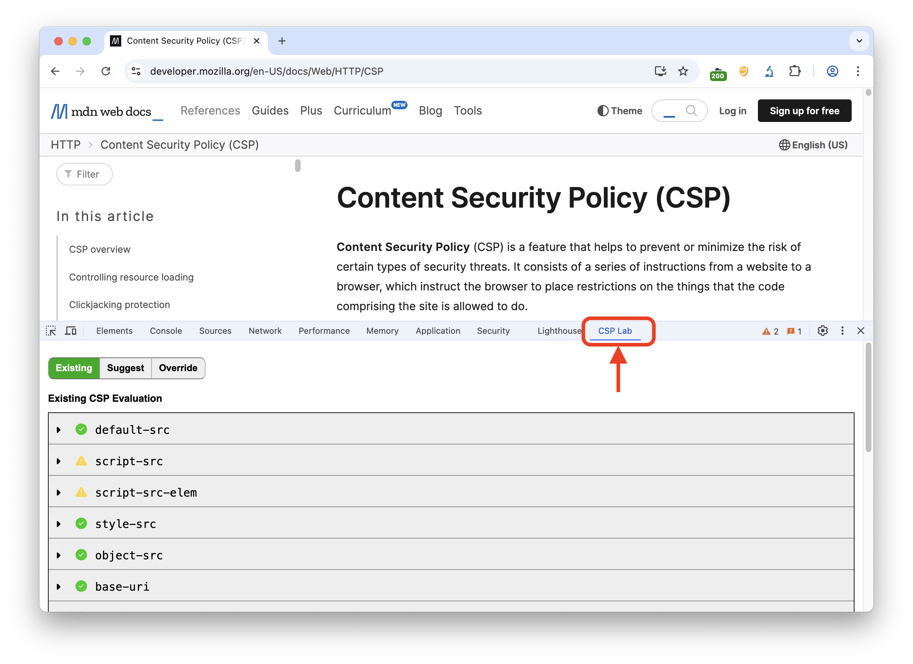
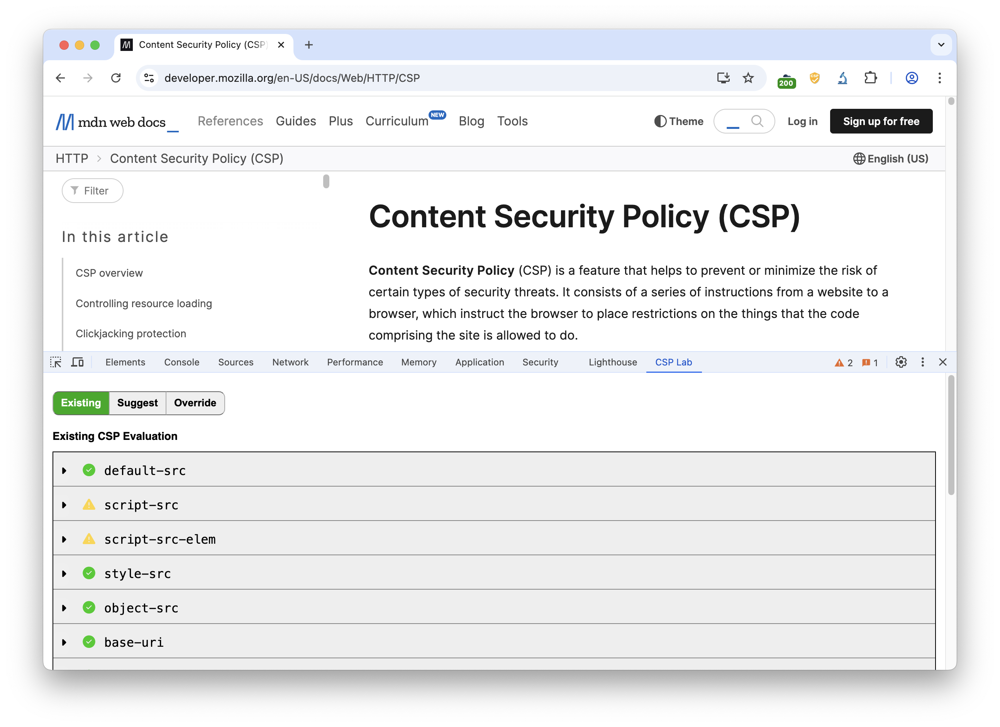
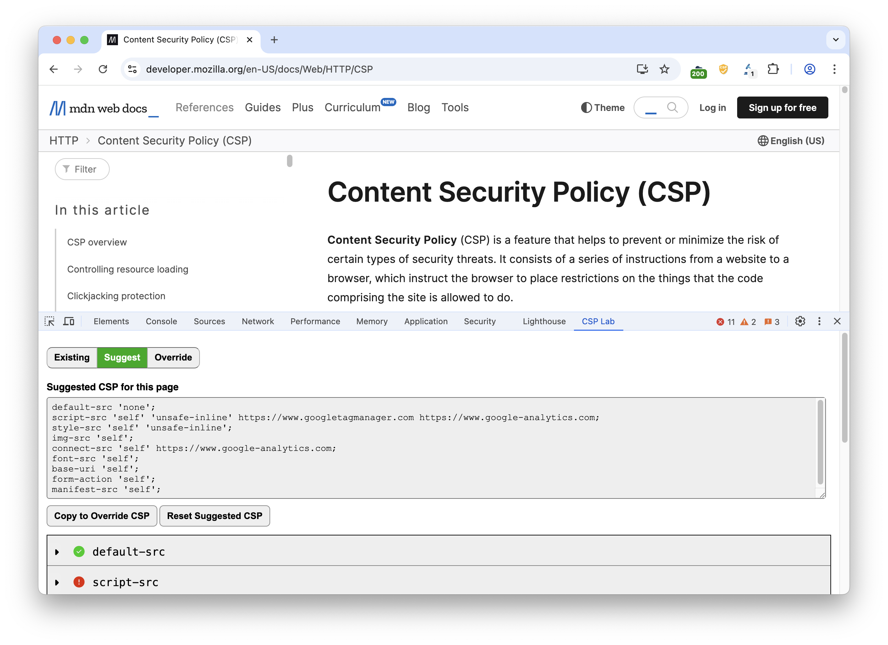
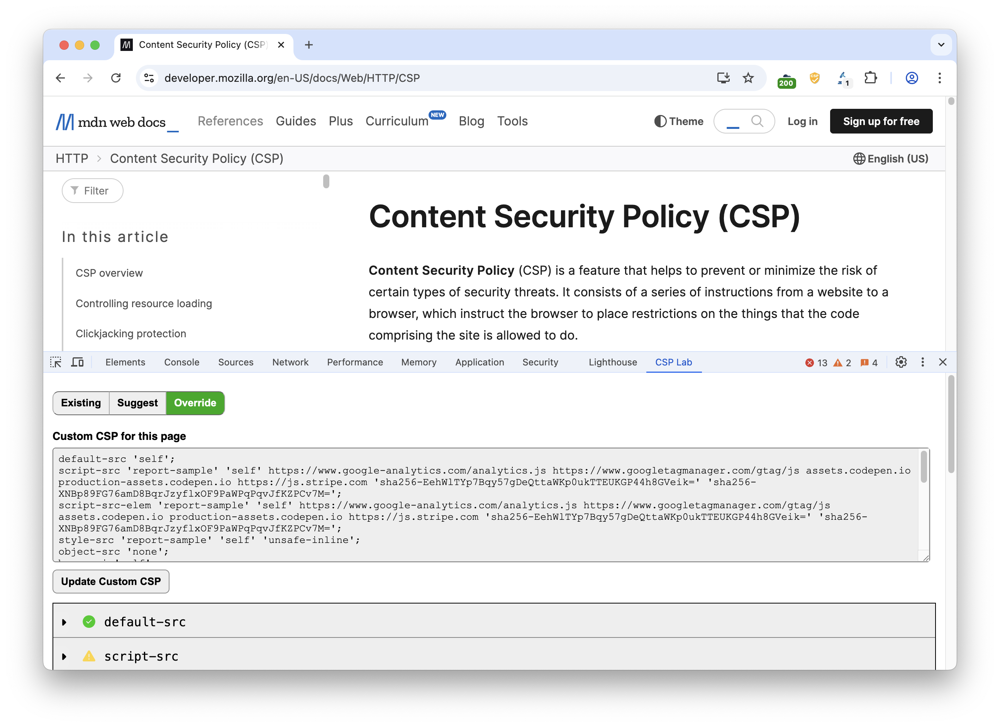
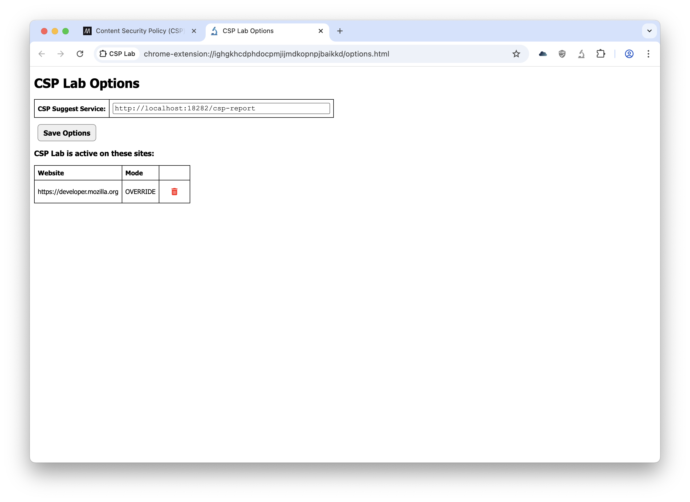

# CSP Lab
Chrome extension for working with Content Security Policies (CSP)


### Overview

Once installed, CSP Lab adds a panel into the Chrome DevTools. This pabnel updates as you navigate from site to site.

On each site that you visit, the panel can be in one of three different modes, which can be changed by toggling the main mode button:

1. **Existing**: Displays an analysis of CSP that is presented by the site, if any exists.
2. **Suggest**: Uses an external service to present a suggested CSP for the site.
3. **Override**: Replace the CSP being sent from the site, if any, with CSP statements that you provide.



## Existing tab


This is the default mode for all sites. It will capture any CSP directives being sent by the site being browsed in the main window.

Using the very excellent (csp_evaluator)[https://github.com/google/csp-evaluator] this tab will present an analysis of the various CSP directives
and describe concerns that might be present.


## Suggest tab


In order to use this feature, you will need to run a separate, external service.

This repository provides an implementation that can be run using Python. In the future, other implementations could be created in whatever language
is most convenient.

#### csp-suggest-service.py

1. Download [csp-suggest-service.py](https://raw.githubusercontent.com/w8wjb/csp-lab/refs/heads/main/csp-suggest-service.py)
2. Run it using Python ```python csp-suggest-service.py```
3. Browse to the site you are developing and activate 'Suggest' mode.

When 'Suggest' mode is active, CSP Lab will override any existing CSP with a `Content-Security-Policy-Report-Only` header that will begin sending reports
of content that *would* have been blocked. The suggest service will collect these reports and use them to build a CSP that will allow the content that
would normally be blocked.

The primary purpose of this feature is to easily generate a starter CSP for sites that have no CSP currently. It would be advisable to edit this starter CSP
further to tailor it to the security needs of your website.

To this end, you can use the `Copy to Override CSP` button to take the CSP displayed in the text box, activate `Override` mode, making the suggested CSP
become the overridden CSP.

If you would like the suggest service to 'forget' all of the reports that it has collected for the domain you are currently viewing, and start collecting
anew, you can use the `Reset Suggested CSP` button.


## Override tab


The third and final mode is `Override`. This mode will simply take the CSP displayed in the text box and use it to override the CSP on domain currently
active in the main window.

If you make changes, use the `Update Custom CSP` button to apply any changes you make in the text box. You will generally need to reload the page to 
have the new CSP take effect.

This override exists at the 'origin' level, meaning the override applies to the scheme, hostname, and port of the URL, but the other parts, such as 
the path are ignored.


## Plugin Options



Clicking on three dots next to the 'CSP Lab' extension icon, and choosing 'Options' will bring up this page.

#### CSP Suggest Service

If you would like to change the URL to access the CSP Suggest service, you can change it here and use the `Save Options` to save the changes.

#### Active sites list

This list will show all origins where you have activated CSP Lab in either 'Suggest' or 'Override' mode. If you would like to remove the
config for a particular site, click the red trash can icon.